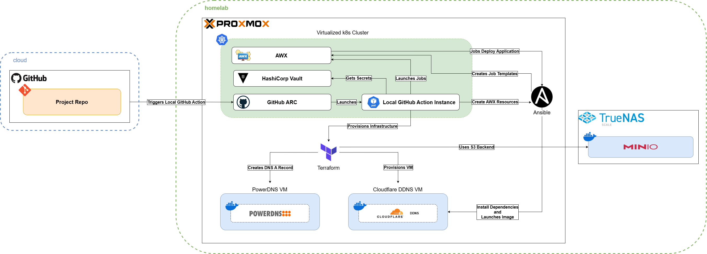

# Homelab - Cloudflare DDNS

This repository is designed for a homelab environment and uses Terraform, Ansible, and GitHub Actions to deploy a containerized Cloudflare Dynamic DNS (DDNS) solution.



> [!IMPORTANT]
> This repository reflects my personal approach and preferences. While it can serve as a reference, it is not intended to be cloned and used without significant modifications.

## Table of Contents

- [Homelab - Cloudflare DDNS](#homelab---cloudflare-ddns)
  - [Table of Contents](#table-of-contents)
  - [Overview](#overview)
  - [Required Tools \& Devcontainer](#required-tools--devcontainer)
  - [Infrastructure Provisioning](#infrastructure-provisioning)
    - [Provisioning Example](#provisioning-example)
      - [Example - Partial Backend Configuration](#example---partial-backend-configuration)
      - [Example - TFVars File](#example---tfvars-file)
      - [Example - Expected Secrets and Environment Variables](#example---expected-secrets-and-environment-variables)
  - [Application Deployment](#application-deployment)
    - [Running AWX Resource Creation Playbook](#running-awx-resource-creation-playbook)
    - [Deployment and Destroy Playbook](#deployment-and-destroy-playbook)
    - [Required Variables and Secrets for Playbook](#required-variables-and-secrets-for-playbook)
      - [AWX Resource Configuration (Existing Organizations, Inventories, and Secrets)](#awx-resource-configuration-existing-organizations-inventories-and-secrets)
      - [Required Deployment Variables](#required-deployment-variables)
      - [Optional Deployment Variables](#optional-deployment-variables)
      - [Secrets Injected via AWX](#secrets-injected-via-awx)
      - [Create AWX Resource Playbook Specific Secrets](#create-awx-resource-playbook-specific-secrets)
  - [CI/CD](#cicd)
    - [Overview of Workflows](#overview-of-workflows)
  - [About My Homelab Deployment](#about-my-homelab-deployment)
    - [Tested Software Versions](#tested-software-versions)

## Overview

At a high level, this repository uses the following technologies:

1. **Terraform** provisions a Proxmox VM
    * Uses a [customized Debian Cloud-Init Image](https://github.com/Knighten-Homelab/ansible-proxmox-cloud-init-template-playbooks)
2. **Ansible** automates AWX resource creation:
    * Adds the host to an inventory and specified group
    * Creates a project for the repository
    * Generates deploy/destroy application job templates
3. **AWX** launches an **Ansible** playbook to deploy the application using roles:
    * Initial VM configuration (hostname setup, FreeIPA integration, etc.)
    * Docker installation (and required dependencies)
    * Docker Compose file generation and deployment
4. **GitHub Actions** provides CI/CD and a GitOps experience:
    * Deploys to the test environment on PR open/changes and auto destroys it
    * Creates semantic versioned GitHub releases (and tags) on PR close
    * Deploys to production on successful GitHub releases
    * Offers a manual workflow to deploy/destroy to either environment

GitHub Actions serves as the glue that integrates all the above technologies. It provisions Proxmox VMs using Terraform, runs an Ansible playbook to create required AWX resources, and then launches AWX job templates to deploy the Cloudflare DDNS container.

The [favonia/cloudflare-ddns](https://github.com/favonia/cloudflare-ddns) container image is used to handle DDNS. It is a lightweight, Alpine-based container that uses the Cloudflare API to update DNS records. The container is deployed using Docker Compose,

## Required Tools & Devcontainer

The two primary tools used in this project are Terraform and Ansible. GitHub Actions and AWX can be easily replaced with your preferred CI/CD and automation solutions.

This project was built using Terraform (1.9.8) and Ansible (core 2.17.5). You can install these tools manually or use the devcontainer provided in this repository. The devcontainer includes all required dependencies, preconfigured development settings, and seamless SSH credential handling. If you have never used a devcontainer before, I highly recommend checking out [Dev Containers](https://containers.dev/)!

For convenience, the devcontainer is configured to mount your home SSH directory (`~/.ssh`) to `/home/vscode/.ssh` inside the container. This setup simplifies SSH credential management when using WSL on Windows. Check [this Stack Overflow post](https://stackoverflow.com/a/73728247) for a better long-term solution for those using WSL.


## Infrastructure Provisioning

This project uses the [terraform-homelab-pve-vm](https://github.com/Johnny-Knighten/terraform-homelab-pve-vm) module, which handles:

1. Creating the VM on Proxmox
2. Creating the A-Record on PowerDNS

### Provisioning Example

Below are the commands to launch the infrastructure deployment using Terraform. A partial Terraform backend is used, so the remaining backend configuration must be provided.

```bash
terraform init -backend-config=backend-example.hcl
terraform apply -var-file=envs/example.tfvars
```

#### Example - Partial Backend Configuration

This project uses a [partial backend configuration](https://developer.hashicorp.com/terraform/language/backend#partial-configuration) for the remote S3 backend. This allows a partially complete backend setup (see [infra/terraform.tf](infra/terraform.tf) for example), while the remaining configuration is provided separately.

Alternatively, you can configure the S3 backend using environment variables:
```bash
export AWS_ENDPOINT_URL_S3="https://minio.local:9000"
export AWS_ACCESS_KEY_ID="your-access-key"
export AWS_SECRET_ACCESS_KEY="your-secret-key"
export AWS_S3_STATE_BUCKET="terraform-state"
```

An example backend configuration file to complete the supplied partial setup:

```hcl
bucket = "terraform-state"
access_key="terraform-service-account"
secret_key="PASSWORD"
endpoints = {
  s3 = "https://minio.local:9000"
}
```

#### Example - TFVars File

Below is an example of the **tfvars** file required to apply the Terraform configuration.

```hcl
/* Proxmox/VM Vars */
pve_url="https://proxmox.local/api2/json"
pve_node="alpha"
vm_name="test"
vm_id=350
vm_ip_address="192.168.90.5"
vm_cidr_prefix_length=24
vm_gateway_address="192.168.90.1"
vm_dns_servers="192.168.90.100 192.168.90.101 192.168.90.1"
vm_vlan=20
vm_ci_store_pool="local-lvm"
vm_disk_store_pool="local-lvm"

/* PDNS Vars */
pdns_url="http://dns.local:8080/"
dns_record_name="test"
dns_zone="example.com"
```

#### Example - Expected Secrets and Environment Variables

The Terraform providers for Proxmox and PowerDNS require the following secrets to be supplied via environment variables:
```bash
export PM_API_TOKEN_ID="your-proxmox-api-token-id"
export PM_API_TOKEN_SECRET="your-proxmox-api-token-secret"
export PDNS_API_KEY="your-powerdns-api-key"
```

> [!NOTE]
> This project uses API keys for authentication with Proxmox and PowerDNS. Refer to the respective provider documentation for alternative authentication methods.

Additionally, the Terraform module requires SSH key pairs used with the Debian Cloud-Init image. These should not be stored in tfvars files. Instead, they should be injected using environment variables:
```bash
export TF_VAR_pve_ci_ssh_private_key="your-private-key"
export TF_VAR_pve_ci_ssh_public_key="your-public-key"
```

## Application Deployment

The deployment of the Cloudflare DDNS solution is handled with AWX and Ansible. There are three major Ansible components:

1. **AWX resource creation/destruction playbooks**  
    - Adds the host to an inventory and specified group  
    - Creates a project for the repository  
    - Generates deploy/destroy application job templates  
2. **The `cloudflare-ddns` role**  
3. **A deployment/destroy playbook**  

The only playbook designed to be launched manually (or via CI/CD) is the AWX resource creation playbook. AWX should be used to launch deployment and destroy playbooks. The deployment playbook applies multiple roles, including `cloudflare-ddns` and other dependency roles (Docker, FreeIPA client, etc.). The `cloudflare-ddns` role creates a service account and a Docker Compose file that runs a container to handle Cloudflare DDNS.


### Running AWX Resource Creation Playbook

Before running this playbook, you need to install the required Ansible dependencies. You have two options:

```bash
# Install just the awx.awx collection required for the playbook
ansible-galaxy collection install awx.awx

# Or install all of the project's Ansible dependencies
ansible-galaxy collection install -r ./collections/requirements.yml
```

Here is an example command for running the playbook that creates all AWX resources:

```bash
# From within the ansible directory
ansible-playbook -i localhost create-awx-cloudflare-ddns-deployment-resources.yml \
  -e awx_target_org="Homelab" \
  -e awx_target_inv="Homelab" \
  -e awx_git_credential="Github - AWX SSH Key" \
  -e project_branch="main" \
  -e target_host_fqdn="cloudflare-ddns.knighten.io" \
  -e host_groups='["proxmox-hosts", "ipa-managed-clients"]' \
  -e cloudflare_ddns_records='[{"zone":"knighten.io","subdomain":"game","proxied":false}]'
```

If preferred, you can create a variable file like this:
```yaml
awx_target_org: "Homelab"
awx_target_inv: "Homelab"
awx_git_credential: "Github - AWX SSH Key"
project_branch: "main"
target_host_fqdn: "cloudflare-ddns.knighten.io"
host_groups:
  - "proxmox-hosts"
  - "ipa-managed-clients"
cloudflare_ddns_records:
  - zone: "knighten.io"
    subdomain: "game"
    proxied: false
```

Then, run the playbook like this:

```bash
# From inside the ansible directory
ansible-playbook -i localhost create-awx-cloudflare-ddns-deployment-resources.yml -e @vars.yml
```

### Deployment and Destroy Playbook

The deployment playbook is designed to be launched via AWX and is not meant to be run manually.
Refer to the [deploy](ansible/deploy-docker-compose-cloudflare-ddns.yaml) and [destroy](ansible/remove-and-clean-docker-compose-cloudflare-ddns.yaml) playbooks used in the AWX job templates for more information.

### Required Variables and Secrets for Playbook

The following variables and secrets must be configured in the AWX job templates that launch the deployment playbook.

The AWX resource creation playbook automatically links job templates to existing secrets and sets required variables.

During execution, I use variable files to pass required values—see them [here](ansible/envs/).

Here are an overview of the variables used:

#### AWX Resource Configuration (Existing Organizations, Inventories, and Secrets)

| **Variable**               | **Description**                             |
| -------------------------- | ------------------------------------------- |
| `awx_target_org`           | Target AWX organization                     |
| `awx_target_inv`           | Target AWX inventory                        |
| `awx_git_credential`       | GitHub credential for AWX repository access |
| `awx_project_branch`       | Git branch to deploy                        |
| `host_groups`              | List of host groups                         |
| `job_template_credentials` | Credentials used in job templates           |

#### Required Deployment Variables

| **Variable**                          | **Description**                   |
| ------------------------------------- | --------------------------------- |
| `host`                                | Target host for deployment        |
| `hostname`                            | Hostname for the deployed service |
| `ipaclient_domain`                    | FreeIPA domain name               |
| `ipaclient_realm`                     | FreeIPA realm name                |
| `ipaclient_server`                    | FreeIPA server address            |
| `cloudflare_ddns_proxied_domains`     | List of proxied domains           |
| `cloudflare_ddns_non_proxied_domains` | List of non-proxied domains       |

#### Optional Deployment Variables

| **Variable**               | **Description**                              |
| -------------------------- | -------------------------------------------- |
| `cloudflare_ddns_app_path` | Path where the DDNS application is installed |

#### Secrets Injected via AWX

| **Secret**           | **Description**         |
| -------------------- | ----------------------- |
| `ipaadmin_principal` | FreeIPA admin principal |
| `ipaadmin_password`  | FreeIPA admin password  |
| `cloudflare_api_key` | API key for Cloudflare  |

#### Create AWX Resource Playbook Specific Secrets

| **Environment Variable** | **Expected Value** |
| ------------------------ | ------------------ |
| `CONTROLLER_HOST`        | AWX Hostname       |
| `CONTROLLER_USERNAME`    | AWX Username       |
| `CONTROLLER_PASSWORD`    | AWX User Password  |


## CI/CD

This project uses **GitHub Actions** to provide a complete CI/CD pipeline and a **GitOps workflow**. The workflows automate linting, deployment, and release management, reducing manual intervention.

### Overview of Workflows

| **Workflow**                | **Trigger**            | **Description**                                                                                      |
| --------------------------- | ---------------------- | ---------------------------------------------------------------------------------------------------- |
| **Deploy to Test**          | PR Open / PR Change    | Deploys infrastructure and application to the test environment on pull request creation or updates.  |
| **Ansible Lint**            | PR Open / PR Change    | Runs Ansible linting to ensure playbooks and roles follow best practices.                            |
| **Terraform Lint & Scan**   | PR Open / PR Change    | Runs Terraform validation, formatting, and security scanning.                                        |
| **Destroy Test Deployment** | PR Close               | Destroys test environment resources when a pull request is closed or merged.                         |
| **Create Release**          | Push to `main`         | Handles PR closures and creates a semantic versioned GitHub release. Also allows quick ad-hoc fixes. |
| **Deploy to Production**    | GitHub Release Created | Automatically deploys the application to the production environment when a release is published.     |
| **Manual Deploy/Destroy**   | Manual Trigger         | Provides an option to manually deploy or destroy in either the test or production environment.       |


## About My Homelab Deployment

Here are a few additional details about my Homelab setup that enable the use of this repository and add more context to my code.

- A single **Proxmox VE (PVE) host** runs both production and test workloads.
- **Minio** serves as the Terraform S3 backend.
- Two **virtualized Kubernetes clusters** (Talos Linux) are used for test and production.
- **HashiCorp Vault** is deployed on Kubernetes for secret management.
- **AWX** is deployed on Kubernetes for Ansible-based automation.
- **GitHub Actions Runner Controller (ARC)** is deployed on Kubernetes, allowing GitHub Actions to run in my Homelab infrastructure.
- 
### Tested Software Versions

| **Component**                              | **Version**                                     |
| ------------------------------------------ | ----------------------------------------------- |
| **Proxmox VE**                             | 8.2-2                                           |
| **Minio**                                  | 1.2.2 RELEASE.2024-11-07T00-52-20Z              |
| **Kubernetes (Talos Linux)**               | v1.8.3 (k8s v1.31.1)                            |
| **HashiCorp Vault**                        | v1.18.1                                         |
| **AWX**                                    | 24.6.1                                          |
| **GitHub Actions Runner Controller (ARC)** | gha-runner-scale-set 0.10.1 / controller 0.10.1 |
